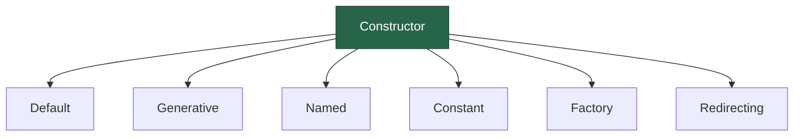

import Tabs from "@theme/Tabs";
import TabItem from "@theme/TabItem";

# Constructors
Constructors are special functions that create instances of classes

## Types of constructors



### Default Constructor
If you don't declare a constructor, Dart provides a default no-argument constructor.

```dart
class Point {
  double x = 0;
  double y = 0;
}

// Usage
var point = Point(); // Uses default constructor
```

### Generative Constructor
The most common type of constructor that directly creates a new instance.

```dart
class Point {
  final double x;
  final double y;

  Point(this.x, this.y); // Generative constructor
}
```

### Named Constructor
Classes can have multiple constructors through named variants.

```dart
class Point {
  double x, y;

  Point(this.x, this.y);
  Point.origin() {
    x = 0;
    y = 0;
  }
}
```

### Constant Constructor
Creates immutable objects when all instance variables are final.

```dart
class ImmutablePoint {
  final double x;
  final double y;

  const ImmutablePoint(this.x, this.y);
}
```

### Factory Constructor
Returns an instance that might not be newly created.

- 💡You can also handle late initialization of a final variable with late final (carefully!).
- ⚠️ Factory constructors can't access this.

```dart
class Logger {
  final String name;
  static final Map<String, Logger> _cache = {};

  factory Logger(String name) {
    return _cache.putIfAbsent(name, () => Logger._internal(name));
  }

  Logger._internal(this.name);
}
```

### Redirecting Constructor
Delegates to another constructor in the same class.

```dart
class Point {
  double x, y;

  Point(this.x, this.y);
  Point.alongXAxis(double x) : this(x, 0);
}
```

## Constructor Initializer Lists
Initialize instance variables before the constructor body runs.

```dart
class Point {
  final double x;
  final double y;
  final double distanceFromOrigin;

  Point(double x, double y)
      : x = x,
        y = y,
        distanceFromOrigin = sqrt(x * x + y * y);
}
```

## Super Constructors
Call a constructor in a parent class.

```dart
class Child extends Parent {
  Child() : super.namedConstructor();
}
```


## Constructor Tear-offs
Dart allows you to supply a constructor as a parameter without calling it. Called a tear-off (as you tear off the parentheses) serves as a closure that invokes the constructor with the same parameters.

If the tear-off is a constructor with the same signature and return type as the method accepts, you can use the tear-off as a parameter or variable.

Tear-offs differ from lambdas or anonymous functions. Lambdas serve as a wrapper for the constructor whereas a tear-off is the constructor.
<Tabs>
<TabItem value="1" label="Use Tear-Offs ✅">

```dart
// Use a tear-off for a named constructor
var strings = charCodes.map(String.fromCharCode);

// Use a tear-off for an unnamed constructor
var buffers = charCodes.map(StringBuffer.new);
```
</TabItem>
<TabItem value="2" label="Not Lambdas ❌">

```dart
// Instead of a lambda for a named constructor:
var strings = charCodes.map((code) => String.fromCharCode(code));

// Instead of a lambda for an unnamed constructor:
var buffers = charCodes.map((code) => StringBuffer(code));
```
</TabItem>
</Tabs>

