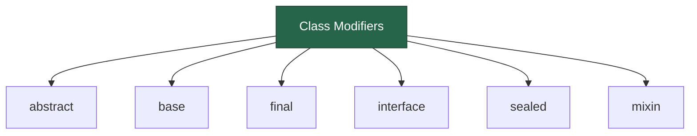

# Dart Class Modifiers

:::tip
Class modifiers were introduced in Dart 3.0 to help create more maintainable and safer APIs.
:::

Dart provides different class modifiers to control how a class is used. These modifiers define whether a class can be instantiated, extended, implemented, or mixed in.



## 1. `abstract` class  

:::tip
Use abstract classes when you want to define a common interface with some shared implementation that multiple classes will inherit.
:::

:::warning
Remember that you cannot create instances of abstract classes, even if they have no abstract methods!
:::

- ❌ Cannot create an object (instance) of an abstract class.  
- ✅ Can be extended (subclassed) or implemented.  
- ✅ Can contain both normal and abstract (unimplemented) methods.  

Example:  
```dart
abstract class Animal {
  void makeSound(); // Abstract method (must be implemented by subclasses)
  
  void breathe() {
    print("Breathing...");
  }
}

class Dog extends Animal {
  @override
  void makeSound() {
    print("Barking...");
  }
}

void main() {
  // Animal a = Animal(); // ❌ Error: Cannot create an instance of an abstract class
  Dog d = Dog();
  d.makeSound(); // ✅ Output: Barking...
  d.breathe();   // ✅ Output: Breathing...
}
```

## 2. `base` class  

:::tip
Use `base` when you want to ensure that all subclasses properly override methods instead of accidentally implementing them.
:::

:::info
The `base` modifier helps prevent the "diamond problem" in inheritance by disallowing implementation outside the library.
:::

- ❌ Cannot be implemented outside its own library.  
- ✅ Can only be extended outside the library.  
- 🔒 Ensures subclasses follow the original class structure.  

Example:  
```dart
base class Vehicle {
  void move() {
    print("Vehicle is moving");
  }
}

// Allowed: Extending within or outside the library
class Car extends Vehicle {
  @override
  void move() {
    print("Car is moving");
  }
}

// Not allowed: Implementing outside the library
// class Bike implements Vehicle {} // ❌ Error

void main() {
  Car c = Car();
  c.move(); // ✅ Output: Car is moving
}
```

## 3. `interface` class  

:::tip
Use `interface` when you want other developers to implement your class's interface but not inherit its implementation details.
:::

- ❌ Cannot be extended outside its library.  
- ✅ Can be implemented outside the library.  
- 🛠 Used to define a contract (only method signatures, no behavior).  

Example:  
```dart
interface class Logger {
  void log(String message);
}

// Allowed: Implementing outside the library
class ConsoleLogger implements Logger {
  @override
  void log(String message) {
    print("Log: $message");
  }
}

void main() {
  ConsoleLogger logger = ConsoleLogger();
  logger.log("This is a log message."); // ✅ Output: Log: This is a log message.
}
```

Example of good interface usage:
```dart
// In your library
interface class HttpClient {
  Future<String> get(String url) async {
    // Implementation details that shouldn't leak
    return _processResponse(await _makeRequest(url));
  }
  
  String _processResponse(dynamic response) => response.toString();
  Future<dynamic> _makeRequest(String url) async => null;
}

// In another library
class MockHttpClient implements HttpClient {
  @override
  Future<String> get(String url) async {
    return 'Mocked response';
  }
}
```

## 4. `final` class  

:::tip
Use `final` for classes that provide complete functionality and shouldn't be extended or implemented, like utility classes or immutable data holders.
:::

:::warning
The `final` modifier is different from the `final` keyword used for variables!
:::

- ❌ Cannot be extended or implemented outside its library.  
- 🔒 Used to prevent inheritance and protect internal logic.  
- ✅ Can still create objects.  

Example:  
```dart
final class Configuration {
  final String environment;
  Configuration(this.environment);
}

void main() {
  Configuration config = Configuration("Production");
  print(config.environment); // ✅ Output: Production
}
```
❌ Cannot do this:  
```dart
// class NewConfig extends Configuration {} // ❌ Error
// class FakeConfig implements Configuration {} // ❌ Error
```

## 5. `sealed` class  

:::tip
`sealed` classes are perfect for representing a fixed set of variants, like states in state management or result types in error handling.
:::

:::info
The Dart compiler ensures exhaustive switching on sealed classes, making them ideal for pattern matching.
:::

- ❌ Cannot be instantiated.  
- 🔒 Only known subclasses (defined in the same library) are allowed.  
- ✅ Used for exhaustive pattern matching (e.g., `switch` statements).  

Example:  
```dart
sealed class Result {}

// Allowed: Defining subclasses in the same library
class Success extends Result {
  final String message;
  Success(this.message);
}

class Failure extends Result {
  final String error;
  Failure(this.error);
}

String handleResult(Result result) {
  return switch (result) {
    Success s => "Success: ${s.message}",
    Failure f => "Error: ${f.error}",
  };
}

void main() {
  Result r = Success("Operation completed");
  print(handleResult(r)); // ✅ Output: Success: Operation completed
}
```

## 6. Combining Modifiers  

:::tip
When combining modifiers, remember that order matters! Always put `abstract` first if you're using it.
:::

Dart allows combining some modifiers to create stricter class rules:

| Modifier Combination | Meaning |
|----------------------|---------|
| `abstract interface class` | A pure interface (no implementation, only method signatures) |
| `abstract base class` | A base class that cannot be implemented, only extended |
| `sealed abstract class` | Similar to `sealed` (because sealed classes are already abstract) |

Example:  
```dart
abstract interface class Animal {
  void makeSound();
}

class Cat implements Animal {
  @override
  void makeSound() {
    print("Meow...");
  }
}

void main() {
  Cat cat = Cat();
  cat.makeSound(); // ✅ Output: Meow...
}
```

Common combinations and their use cases:

```dart
// Pure interface with no implementation
abstract interface class Repository {
  Future<void> save(String data);
  Future<String> load();
}

// Base class that can't be instantiated
abstract base class BaseRepository {
  final String storageKey;
  
  BaseRepository(this.storageKey);
  
  // Shared implementation details
  Future<void> initialize() async {
    // Implementation
  }
}
```

## Best Practices

:::tip
1. Start with the most restrictive modifier and relax constraints only when needed
2. Use `sealed` for enum-like classes where you need to ensure exhaustive handling
3. Prefer `interface` over `abstract` when you don't need to share implementation
4. Use `base` when you want to enforce proper inheritance
:::

## Common Pitfalls

:::warning
1. Don't use `final` just to prevent inheritance - consider if `interface` or `base` might be more appropriate
2. Remember that `sealed` classes can only have subclasses in the same library
3. Be careful with modifier combinations - not all combinations are valid
:::

# Summary Table  
| Modifier   | Can Instantiate? | Can Extend? | Can Implement? | Restriction |
|------------|----------------|-------------|---------------|-------------|
| `abstract` | ❌ No | ✅ Yes | ✅ Yes | Must be subclassed or implemented |
| `base` | ✅ Yes | ✅ Yes | ❌ No (outside library) | Only extends outside library |
| `interface` | ✅ Yes | ❌ No | ✅ Yes | Only implemented outside library |
| `final` | ✅ Yes | ❌ No | ❌ No | No subclassing or implementing outside library |
| `sealed` | ❌ No | ✅ Yes (same library only) | ❌ No | Must define all subclasses in the same library |

## When to Use Which Modifier?
- Use `abstract` when you don’t want a class to be instantiated but allow extending.
- Use `base` when you want to allow extending but restrict implementing outside the library.
- Use `interface` when you only want a class to be implemented (like a blueprint).
- Use `final` when you want to completely prevent inheritance.
- Use `sealed` when you want a fixed set of subclasses.

## Migration Tips

:::tip
When migrating existing code to use modifiers:

1. Start with `final` for leaf classes (classes not meant to be inherited)
2. Use `interface` for classes that are commonly implemented
3. Add `base` to classes that should only be extended
4. Convert enum-like hierarchies to `sealed` classes
:::

This guide simplifies Dart class modifiers and helps you decide when to use them in your code. 🚀