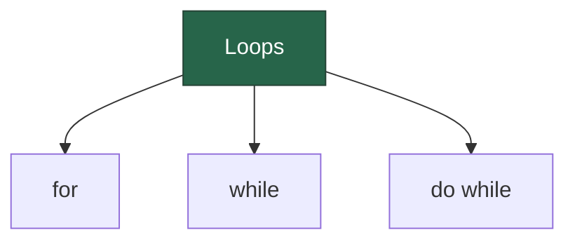
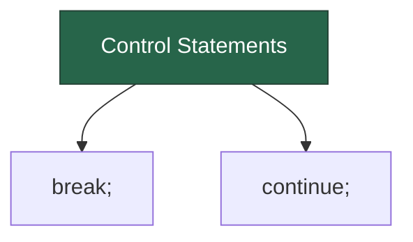

## For loops

You can iterate with the standard `for` loop. For example:

```dart
var message = StringBuffer('Dart is fun');
for (var i = 0; i < 5; i++) {
  message.write('!');
}
```

Closures inside of Dart's `for` loops capture the _value_ of the index.
This avoids a common pitfall found in JavaScript. For example, consider:

```dart
var callbacks = [];
for (var i = 0; i < 2; i++) {
  callbacks.add(() => print(i));
}

for (final c in callbacks) {
  c();
}
```

The output is `0` and then `1`, as expected. In contrast, the example
would print `2` and then `2` in JavaScript.

Sometimes you might not need to know the current iteration counter
when iterating over an [`Iterable`][] type, like `List` or `Set`.
In that case, use the `for-in` loop for cleaner code:


```dart
for (final candidate in candidates) {
  candidate.interview();
}
```

To process the values obtained from the iterable, 
you can also use a [pattern][] in a `for-in` loop:

```dart
for (final Candidate(:name, :yearsExperience) in candidates) {
  print('$name has $yearsExperience of experience.');
}
```

:::tip
To practice using `for-in`, follow the
<!-- [Iterable collections tutorial](/libraries/collections/iterables). -->
:::

Iterable classes also have a [forEach()][] method as another option:


```dart
var collection = [1, 2, 3];
collection.forEach(print); // 1 2 3
```


## While and do-while

A `while` loop evaluates the condition before the loop:


```dart
while (!isDone()) {
  doSomething();
}
```

A `do`-`while` loop evaluates the condition *after* the loop:


```dart
do {
  printLine();
} while (!atEndOfPage());
```


## Control Statements



Use `break` to stop looping:


```dart
while (true) {
  if (shutDownRequested()) break;
  processIncomingRequests();
}
```

Use `continue` to skip to the next loop iteration:


```dart
for (int i = 0; i < candidates.length; i++) {
  var candidate = candidates[i];
  if (candidate.yearsExperience < 5) {
    continue;
  }
  candidate.interview();
}
```

If you're using an [`Iterable`][] such as a list or set,
how you write the previous example might differ:


```dart
candidates
    .where((c) => c.yearsExperience >= 5)
    .forEach((c) => c.interview());
```