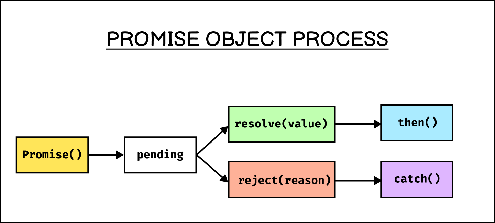

# Synchronous & Asynchronous in JavaScript

> JavaScript's single-threaded nature means it can handle one operation at a time. To manage tasks like network requests or file operations without freezing the main thread, JavaScript employs asynchronous programming.

## **1️⃣ Synchronous (Blocking)**

- Code executes **line by line**, waiting for each task to finish before moving to the next.
- Slows execution if a task takes too long.

✅ **Example:**

```js
console.log("Task 1");
console.log("Task 2");
console.log("Task 3");
```

**Output:**

```
Task 1
Task 2
Task 3
```

👉 Each statement waits for the previous one to complete.


## **2️⃣ Asynchronous (Non-Blocking)**

- Code execution **continues** without waiting for a task to finish.
- Uses **callbacks, promises, and async/await** to handle async operations like API calls, file reading, and setTimeout.

✅ **Example (setTimeout - Callback Example)**

```js
console.log("Task 1");
setTimeout(() => console.log("Task 2 (Delayed)"), 1000);
console.log("Task 3");
```

**Output:**

```
Task 1
Task 3
Task 2 (Delayed)  // Executed after 1 second
```

👉 `setTimeout` runs in the background while Task 3 executes.


## **Event Loop and Concurrency**

JavaScript utilizes an event loop to manage asynchronous operations. The event loop continuously checks the call stack and the task queue. If the call stack is empty, it processes the next task in the queue. This mechanism allows JavaScript to handle asynchronous events efficiently without blocking the main thread.

Practical Applications:

- Network Requests: Fetching data from APIs without freezing the user interface.

- Timers: Executing code after a specified delay using functions like setTimeout.

- Event Handling: Responding to user interactions such as clicks or key presses asynchronously.

---

## **Promises**

A Promise is an object that represents the eventual completion (or failure) of an asynchronous operation and its resulting value. It can be in one of three states:

1. **pending**: The initial state, neither fulfilled nor rejected.
2. **resolve (Fulfilled)**: The operation completed successfully, and the promise has a value.
3. **rejected**: The operation failed, and the promise has a reason for the failure.



### **Creating a Promise**

To create a Promise, you use the `Promise` constructor, which takes an executor function with two parameters: `resolve` and `reject`.

```js
const myPromise = new Promise((resolve, reject) => {
  // Asynchronous operation
  let success = true; // This is just an example condition
  if (success) {
    resolve("Operation was successful");
  } else {
    reject("Operation failed");
  }
});
```

In this example, `resolve` is called if the operation is successful, and `reject` is called if it fails.

### **Handling Promises**

Promises provide methods to handle the outcome of the asynchronous operation:

- **`then(onFulfilled, onRejected)`**: Adds fulfillment and rejection handlers to the promise.
- **`catch(onRejected)`**: Adds a rejection handler; equivalent to `then(null, onRejected)`.
- **`finally(onFinally)`**: Adds a handler to be called regardless of the promise's outcome.

```js
myPromise
  .then((value) => {
    console.log(value); // "Operation was successful"
  })
  .catch((error) => {
    console.error(error); // "Operation failed"
  })
  .finally(() => {
    console.log("Operation completed");
  });
```

### **Chaining Promises**

Promises can be chained to handle sequences of asynchronous operations. Each `then` returns a new promise, allowing for the chaining of multiple asynchronous tasks.

```js
fetchData()
  .then((data) => processData(data))
  .then((processedData) => displayData(processedData))
  .catch((error) => {
    console.error("Error:", error);
  });
```

In this chain, each `then` processes the result of the previous promise, and `catch` handles any errors that occur in the chain.

### **Promise Combinators**

JavaScript provides several methods to work with multiple promises simultaneously:

- **`Promise.all(iterable)`**: Waits for all promises to fulfill or any to reject. Returns a promise that fulfills with an array of fulfillment values or rejects with the reason of the first rejected promise.

  ```js
  Promise.all([promise1, promise2, promise3])
    .then((values) => {
      console.log(values); // [value1, value2, value3]
    })
    .catch((error) => {
      console.error(error);
    });
  ```

- **`Promise.race(iterable)`**: Returns a promise that fulfills or rejects as soon as one of the promises in the iterable fulfills or rejects.

- **`Promise.allSettled(iterable)`**: Waits until all promises have settled (each may resolve or reject) and returns an array of their results.

- **`Promise.any(iterable)`**: Returns a promise that fulfills as soon as any of the promises in the iterable fulfills, or rejects if all of them reject.

### **Async/Await Syntax**

Introduced in ES2017, `async` and `await` provide a more synchronous way to work with promises. An `async` function returns a promise, and the `await` keyword pauses the execution of the function until the awaited promise settles.

```js
async function fetchData() {
  try {
    const response = await fetch("https://api.example.com/data");
    const data = await response.json();
    console.log(data);
  } catch (error) {
    console.error("Error:", error);
  }
}
```

In this example, `fetchData` is an asynchronous function that waits for the `fetch` operation to complete before proceeding.

### **Error Handling in Promises**

Proper error handling is crucial in promise-based code. Use `catch` to handle errors and `finally` for cleanup actions that should occur regardless of the outcome.

```js
myPromise
  .then((value) => {
    // Handle fulfillment
  })
  .catch((error) => {
    // Handle rejection
  })
  .finally(() => {
    // Cleanup actions
  });
```

By understanding and utilizing promises effectively, you can write more readable and maintainable asynchronous JavaScript code.
