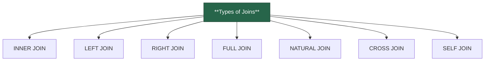

import Tabs from "@theme/Tabs";
import TabItem from "@theme/TabItem";



<br></br>
<div style={{display: 'flex'}}>
    <div>
        <h4>STUDENT</h4>
        | STUD_ID | NAME    |
        |---------|---------|
        | 1       | Alex    |
        | 2       | Bob     |
        | 3       | Charlie |
    </div>
    <div style={{width: '20px'}}></div>
    <div>
        <h4>COURSE</h4>
        | STUD_ID | COURSE_NAME |
        |---------|-------------|
        | 1       | Math        |
        | 2       | Science     |
        | 4       | History     |
    </div>
</div>

 

:::info Types of Joins
<Tabs>
<TabItem value="1" label="INNER JOIN">

🔹Returns only the matching rows between two tables. 


**Query:**
```sql
SELECT STUDENT.NAME, COURSE.COURSE_NAME  
FROM STUDENT  
INNER JOIN COURSE ON STUDENT.STUD_ID = COURSE.STUD_ID;
```

**Result:**  
| NAME  | COURSE_NAME |  
|------|------------|  
| Alex  | Math       |  
| Bob   | Science    |  

✅ **Only students who have a matching course are returned.**  
</TabItem>

<TabItem value="2" label="LEFT JOIN">

🔹Returns all rows from the left table and matching rows from the right table. Unmatched rows from the right table appear as NULL.


**Query:**
```sql
SELECT STUDENT.NAME, COURSE.COURSE_NAME  
FROM STUDENT  
LEFT JOIN COURSE ON STUDENT.STUD_ID = COURSE.STUD_ID;
```

**Result:**  
| NAME  | COURSE_NAME |  
|------|------------|  
| Alex  | Math       |  
| Bob   | Science    |  
| Charlie | NULL       |  

✅ **Charlie has no matching course, so COURSE_NAME is NULL.**  

</TabItem>

<TabItem value="3" label="RIGHT JOIN">
🔹Returns all rows from the right table and matching rows from the left table. Unmatched rows from the left table appear as NULL.  


**Query:**
```sql
SELECT STUDENT.NAME, COURSE.COURSE_NAME  
FROM STUDENT  
RIGHT JOIN COURSE ON STUDENT.STUD_ID = COURSE.STUD_ID;
```

**Result:**  
| NAME  | COURSE_NAME |  
|------|------------|  
| Alex  | Math       |  
| Bob   | Science    |  
| NULL  | History    |  

✅ **History is present in COURSE but has no matching student.**  

</TabItem>

<TabItem value="4" label="FULL JOIN">
🔹Returns all records from both tables. Unmatched records appear as NULL.

**Query:**
```sql
SELECT STUDENT.NAME, COURSE.COURSE_NAME  
FROM STUDENT  
FULL JOIN COURSE ON STUDENT.STUD_ID = COURSE.STUD_ID;
```

**Result:**  
| NAME  | COURSE_NAME |  
|------|------------|  
| Alex  | Math       |  
| Bob   | Science    |  
| Charlie | NULL       |  
| NULL  | History    |  

✅ **Includes all students and all courses, even if there's no match.**  

</TabItem>

<TabItem value="5" label="CROSS JOIN">
🔹Produces a Cartesian product, meaning every row from one table is combined with every row from the other table.


**Query:**
```sql
SELECT STUDENT.NAME, COURSE.COURSE_NAME  
FROM STUDENT  
CROSS JOIN COURSE;
```

**Result:**  
| NAME  | COURSE_NAME |  
|------|------------|  
| Alex  | Math       |  
| Alex  | Science    |  
| Alex  | History    |  
| Bob   | Math       |  
| Bob   | Science    |  
| Bob   | History    |  
| Charlie | Math       |  
| Charlie | Science    |  
| Charlie | History    |  

✅ **Every student is paired with every course.**  

</TabItem>

<TabItem value="6" label="SELF JOIN">
🔹A table joins with itself to find relationships within the same dataset.


**Table: EMPLOYEE**
| EMP_ID | NAME  | MANAGER_ID |  
|--------|------|------------|  
| 1      | Alice | NULL       |  
| 2      | Bob   | 1          |  
| 3      | Charlie | 1        |  
| 4      | David | 2          |  

**Query:**
```sql
SELECT E1.NAME AS Employee, E2.NAME AS Manager  
FROM EMPLOYEE E1  
JOIN EMPLOYEE E2 ON E1.MANAGER_ID = E2.EMP_ID;
```

**Result:**  
| Employee | Manager |  
|---------|---------|  
| Bob     | Alice   |  
| Charlie | Alice   |  
| David   | Bob     |  

✅ **Shows employee-manager relationships using the same table.**  

</TabItem>
<TabItem value="7" label="NATURAL JOIN">

✅ A **NATURAL JOIN** automatically joins tables **using columns with the same name and data type**.  
✅ It **eliminates duplicate column names** in the result.  
✅ It can be **INNER JOIN or OUTER JOIN**, depending on the requirement.  

**Query:**  
```sql
SELECT * FROM STUDENT  
NATURAL JOIN ENROLLMENT;
```

**Result:**  
| STUD_ID | NAME  | COURSE_NAME |  
|---------|------|------------|  
| 1       | Alex  | Math       |  
| 2       | Bob   | Science    |  

✅ **NATURAL JOIN automatically matches on `STUD_ID`, so we don’t need `ON` or `USING`.**   


</TabItem>
</Tabs>
:::


### SELF JOIN vs NATURAL JOIN

| Feature        | SELF JOIN | NATURAL JOIN |
|---------------|----------|--------------|
| **Definition** | Joins the table with itself | Automatically joins tables using common column names |
| **Use Case** | Finding relationships within the same table (e.g., employee-manager) | Joining related tables (e.g., students & courses) |
| **Explicit Condition Needed?** | ✅ Yes (`ON` condition required) | ❌ No (`ON` is not needed) |
| **Duplicate Column Names?** | ✅ Yes, may need aliasing | ❌ No, it removes duplicate columns |


## Summary Table

| JOIN Type      | Returns | NULLs for Unmatched Rows |
|---------------|---------|--------------------------|
| **INNER JOIN**  | Only matching rows | ❌ |
| **LEFT JOIN**   | All left, matching right | ✅ Right |
| **RIGHT JOIN**  | All right, matching left | ✅ Left |
| **FULL JOIN**   | All rows from both tables | ✅ Both |
| **CROSS JOIN**  | All possible row combinations | ❌ |
| **SELF JOIN**   | Joins the table with itself | ❌ |

