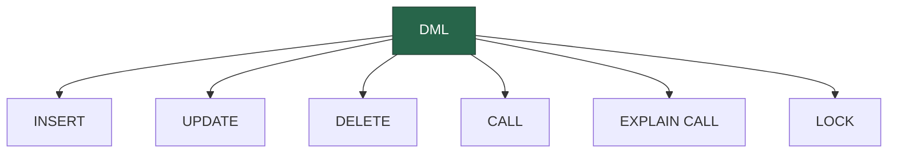

Data Manipulation Language (DML) commands are used for managing data within schema objects.

:::tip INFO

- **INSERT:** Adds new data to a table.
- **UPDATE:** Modifies existing data within a table.
- **DELETE:** Removes data from a table.
- **CALL:** Executes a stored procedure.
- **EXPLAIN CALL:** Provides information about how a stored procedure is executed.
- **LOCK:** Locks a table or a row for a transaction.
  :::
