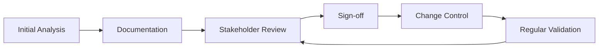

import Tabs from '@theme/Tabs';
import TabItem from '@theme/TabItem';

# 📋 Phase 1: Requirements Collection


Requirements collection is the **foundation** of any software project. This phase involves gathering, analyzing, and documenting what the software needs to accomplish.

**Gathering requirements directly from the customer** to understand their business needs and translate them into software specifications.


## Key Roles and Responsibilities

<Tabs>
<TabItem value="ba" label="🎯 Business Analyst" default>

### Business Analyst (BA) / Product Analyst

- **Primary Role:** Acts as a bridge between the customer and the software company
- **Responsibilities:**
  - Conduct stakeholder interviews
  - Translate business needs into technical requirements
  - Document functional and non-functional requirements
  - Validate requirements with stakeholders
  - Manage requirement changes (if any)

:::note Who can be a BA?
- Experienced domain experts (typically 10–15 years of experience)
- Strong communication and analytical skills
- Understanding of both business and technical domains
:::

</TabItem>
<TabItem value="developer" label="👨‍💻 Developer">

### Developer (for small projects)

- **When:** For small projects where a dedicated BA is not required
- **Responsibilities:**
  - Direct interaction with client
  - Requirement gathering and documentation
  - Technical feasibility assessment

</TabItem>
</Tabs>

## Types of Requirements

<Tabs>
<TabItem value="functional" label="⚙️ Functional" default>

### 1. Functional Requirements

:::success Definition
**What the system should do** - The core features and functionality
:::

```typescript title="Examples:"
// User Management
- User authentication and authorization
- User profile management
- Role-based access control

// Data Operations
- Data processing capabilities
- CRUD operations
- Data validation and sanitization

// Business Logic
- Business rule implementation
- Workflow automation
- Integration with external systems
```

</TabItem>
<TabItem value="non-functional" label="⚡ Non-Functional">

### 2. Non-Functional Requirements

:::success Definition
**How the system should perform** - Quality attributes and constraints
:::

```typescript title="Examples:"
// Performance Requirements
- Response time < 2 seconds for 95% of requests
- Support 10,000 concurrent users
- Database query optimization
- Caching strategies

// Security Requirements
- Data encryption at rest and in transit
- Multi-factor authentication
- Regular security audits
- GDPR/CCPA compliance

// Usability Requirements
- Responsive design for mobile devices
- Accessibility compliance (WCAG 2.1)
- Intuitive user interface
- Multi-language support

// Reliability Requirements
- 99.9% uptime SLA
- Automated backup and recovery
- Error handling and logging
- Graceful degradation
```
</TabItem>
</Tabs>

## Common Challenges

### ❓ Why do customers keep changing requirements?

1. **Market Competition:**\
 Need to stay ahead of competitors with new features and capabilities
1. **Business Evolution:**\
 Evolving business strategies, goals, and market conditions  
1. **Technology Updates:**\
 New technologies offering better solutions and opportunities
1. **User Feedback:**\
 Insights from user testing, feedback, and real-world usage
1. **Regulatory Changes:**\
 New compliance requirements and legal obligations


## Best Practices

:::caution Remember
Following these best practices will significantly improve your requirements collection success rate.
:::

### 🛠️ Mitigation Strategies
Implement these proven strategies to minimize requirement changes and improve project success rates.




1. **Thorough Initial Analysis:**\
  Spend adequate time in requirement gathering and stakeholder interviews
2. **Clear Documentation:**\
  Ensure all requirements are well-documented with examples and acceptance criteria
3. **Stakeholder Alignment:**\
  Get formal sign-off from all key stakeholders before proceeding
4. **Change Management Process:**\
  Establish a formal process for handling requirement changes with impact analysis
5. **Regular Reviews:**\
  Conduct periodic requirement validation sessions with stakeholders

### 🤔 Do's or Don'ts

<div style={{display: 'grid', gridTemplateColumns: '1fr 1fr', gap: '2rem', margin: '2rem 0'}}>

<div>
<h3 style={{color: 'var(--ifm-color-success)', display: 'flex', alignItems: 'center', gap: '0.5rem'}}>
  ✅ Do's
</h3>

- **Involve all relevant stakeholders** early and often
- **Document everything clearly** with examples and visuals
- **Validate requirements regularly** through reviews and prototypes
- **Use visual aids** (diagrams, mockups, wireframes)
- **Prioritize requirements** (must-have vs. nice-to-have)
- **Consider edge cases** and error scenarios
- **Establish clear acceptance criteria** for each requirement

</div>

<div>
<h3 style={{color: 'var(--ifm-color-danger)', display: 'flex', alignItems: 'center', gap: '0.5rem'}}>
  ❌ Don'ts
</h3>

- **Don't assume** what the customer wants
- **Don't skip requirement validation** with stakeholders
- **Don't proceed** with unclear or ambiguous requirements
- **Don't ignore non-functional requirements** (they're critical!)
- **Don't forget to consider edge cases** and failure scenarios
- **Don't rush** the requirements gathering phase
- **Don't work in isolation** - collaborate with your team

</div>

</div>

---

<div style={{textAlign: 'center', margin: '2rem 0', padding: '1rem', backgroundColor: 'var(--ifm-color-emphasis-100)', borderRadius: '8px'}}>
<h4>🎯 Key Takeaway</h4>
<p><strong>Quality requirements lead to quality software.</strong> Invest time upfront to save time and resources later in the development cycle.</p>
</div>
