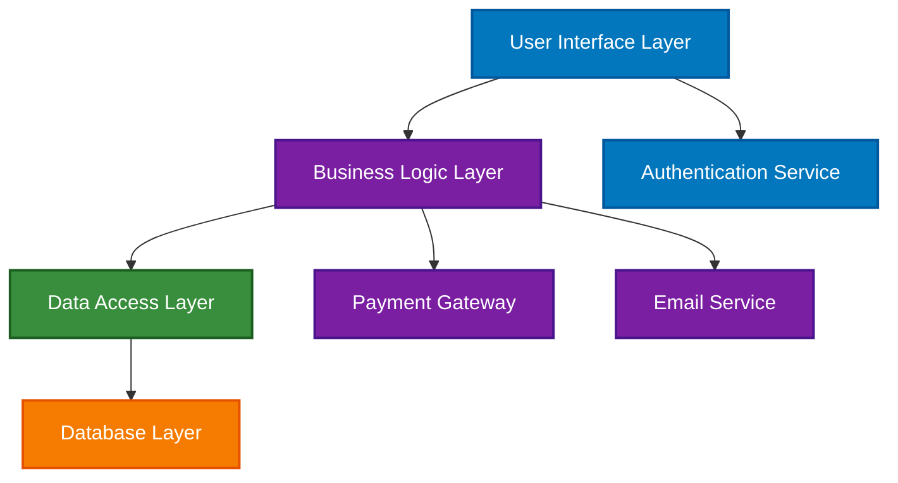

import Tabs from '@theme/Tabs';
import TabItem from '@theme/TabItem';

# 🎨 Phase 3: Design

> The design phase translates requirements into a **blueprint for building the software**. It involves creating both high-level architecture and detailed technical specifications.

## Key Roles and Responsibilities

<Tabs>
<TabItem value="architect" label="🏗️ Architect" default>

### Architect
- **Primary Role:** Design overall system architecture
- **Responsibilities:**
  - Create high-level design (HLD)
  - Define system architecture patterns
  - Choose technology stack
  - Ensure scalability and performance
  - Define integration patterns

</TabItem>
<TabItem value="senior-dev" label="👨‍💻 Senior Developer">

### Software Developer (Senior)
- **Role:** Detailed technical design
- **Responsibilities:**
  - Create low-level design (LLD)
  - Design individual modules and components
  - Define data structures and algorithms
  - Create detailed technical specifications
  - Review and validate designs

</TabItem>
<TabItem value="ui-ux" label="🎨 UI/UX Designer">

### UI/UX Designer
- **Role:** User interface and experience design
- **Responsibilities:**
  - Create user interface mockups
  - Design user experience flows
  - Develop design systems and style guides
  - Ensure accessibility compliance
  - Prototype interactions

</TabItem>
</Tabs>

## Types of Design

<Tabs>
<TabItem value="hld" label="🏛️ High-Level Design" default>

### 1. High-Level Design (HLD)

:::success Purpose
**Provides an architectural overview of the entire system**
:::

**Components:**

<details>
<summary>🏗️ **System Architecture**</summary>

- Overall system structure
- Major components and their relationships
- Technology stack selection
- Deployment architecture

</details>

<details>
<summary>📦 **Module Breakdown**</summary>

- Main functional modules (e.g., Login, Dashboard, User Management)
- Inter-module communication
- Data flow between modules
- External system integrations

</details>

<details>
<summary>⚙️ **Technology Decisions**</summary>

- Programming languages and frameworks
- Database selection
- Third-party services and APIs
- Infrastructure requirements

</details>

**Example HLD Components:**


</TabItem>
<TabItem value="lld" label="🔧 Low-Level Design">

### 2. Low-Level Design (LLD)

:::success Purpose
**Provides detailed design for each module and component**
:::

**Components:**

<details>
<summary>🔧 **Module-Level Design**</summary>

- Detailed logic for each module
- Class diagrams and relationships
- Method signatures and interfaces
- Error handling strategies

</details>

<details>
<summary>🗄️ **Database Design**</summary>

- Entity-Relationship (ER) diagrams
- Table structures and relationships
- Indexes and constraints
- Data normalization

</details>

<details>
<summary>🧠 **Algorithm Design**</summary>

- Pseudocode for complex algorithms
- Time and space complexity analysis
- Optimization strategies
- Edge case handling

</details>

**Example LLD Components:**

```typescript title="Class Design Example"
// User Management Module:
class UserController {
  // Handle HTTP requests
  createUser(userData: UserData): Promise<User>
  getUserById(id: string): Promise<User>
  updateUser(id: string, data: Partial<UserData>): Promise<User>
  deleteUser(id: string): Promise<boolean>
}

class UserService {
  // Business logic implementation
  validateUserData(data: UserData): ValidationResult
  hashPassword(password: string): string
  checkUserExists(email: string): Promise<boolean>
}

class UserRepository {
  // Data access operations
  save(user: User): Promise<User>
  findById(id: string): Promise<User | null>
  findByEmail(email: string): Promise<User | null>
  delete(id: string): Promise<boolean>
}
```

```sql title="Database Tables Example"
-- Users Table
CREATE TABLE users (
  user_id UUID PRIMARY KEY,
  username VARCHAR(50) UNIQUE NOT NULL,
  email VARCHAR(255) UNIQUE NOT NULL,
  password_hash VARCHAR(255) NOT NULL,
  created_at TIMESTAMP DEFAULT CURRENT_TIMESTAMP,
  updated_at TIMESTAMP DEFAULT CURRENT_TIMESTAMP
);
```

</TabItem>
<TabItem value="ui-design" label="🎨 UI Design">

### 3. User Interface Design

:::success Purpose
**Define the visual and interactive aspects of the application**
:::

**Components:**

<details>
<summary>📐 **Wireframes**</summary>

- Basic layout structure
- Navigation patterns
- Content organization
- User flow diagrams

</details>

<details>
<summary>🎨 **Mockups**</summary>

- Visual design elements
- Color schemes and typography
- Interactive components
- Responsive design considerations

</details>

<details>
<summary>🔗 **Prototypes**</summary>

- Interactive demonstrations
- User testing validation
- Usability feedback incorporation
- Design iteration

</details>

</TabItem>
</Tabs>

## Design Principles

:::warning Key Design Principles
Following these principles ensures maintainable, scalable, and robust software architecture.
:::

<Tabs>
<TabItem value="solid" label="🏗️ SOLID Principles" default>

### SOLID Principles

<div style={{display: 'flex', flexDirection: 'column', gap: '0.5rem'}}>

**S - Single Responsibility Principle**  
Each class should have only one reason to change

**O - Open/Closed Principle**  
Software entities should be open for extension, closed for modification

**L - Liskov Substitution Principle**  
Objects should be replaceable with instances of their subtypes

**I - Interface Segregation Principle**  
Many client-specific interfaces are better than one general-purpose interface

**D - Dependency Inversion Principle**  
Depend on abstractions, not concretions

</div>

</TabItem>
<TabItem value="patterns" label="🎯 Design Patterns">

### Design Patterns

<details>
<summary>🏭 **Creational Patterns**</summary>

- **Singleton:** Ensure only one instance exists
- **Factory:** Create objects without specifying exact classes
- **Builder:** Construct complex objects step by step

</details>

<details>
<summary>🔗 **Structural Patterns**</summary>

- **Adapter:** Allow incompatible interfaces to work together
- **Decorator:** Add behavior to objects dynamically
- **Facade:** Provide simplified interface to complex subsystems

</details>

<details>
<summary>⚡ **Behavioral Patterns**</summary>

- **Observer:** Define subscription mechanism for object events
- **Strategy:** Define family of algorithms and make them interchangeable
- **Command:** Encapsulate requests as objects

</details>

</TabItem>
<TabItem value="architecture" label="📐 Architecture Patterns">

### Architectural Patterns

<div style={{display: 'grid', gridTemplateColumns: 'repeat(auto-fit, minmax(250px, 1fr))', gap: '1rem', margin: '1rem 0'}}>

<div style={{padding: '1rem', border: '1px solid var(--ifm-color-emphasis-200)', borderRadius: '8px'}}>
<h4>🎯 MVC Pattern</h4>
Model-View-Controller separation for better organization
</div>

<div style={{padding: '1rem', border: '1px solid var(--ifm-color-emphasis-200)', borderRadius: '8px'}}>
<h4>🔧 Microservices</h4>
Decompose application into small, independent services
</div>

<div style={{padding: '1rem', border: '1px solid var(--ifm-color-emphasis-200)', borderRadius: '8px'}}>
<h4>📚 Layered Architecture</h4>
Organize code into horizontal layers with specific responsibilities
</div>

<div style={{padding: '1rem', border: '1px solid var(--ifm-color-emphasis-200)', borderRadius: '8px'}}>
<h4>⚡ Event-Driven</h4>
Use events to trigger and communicate between decoupled components
</div>

</div>

</TabItem>
</Tabs>

## Design Documentation

### 📋 Architecture Document
**Contents:**
- System overview and objectives
- Architecture diagrams and descriptions
- Technology stack justification
- Non-functional requirements mapping
- Risk assessment and mitigation

### 🔧 Technical Specification
**Contents:**
- Detailed component specifications
- API documentation and contracts
- Database schema and relationships
- Security implementation details
- Performance optimization strategies

### 🎨 Design System
**Contents:**
- UI component library
- Style guide and branding
- Accessibility guidelines
- Responsive design specifications
- Interaction patterns

## Design Review Process

### 1. 🔍 Peer Review
- Technical accuracy validation
- Best practices compliance
- Code maintainability assessment
- Performance implications review

### 2. 👥 Stakeholder Review
- Business requirement alignment
- User experience validation
- Budget and timeline impact
- Risk assessment review

### 3. ✅ Approval Process
- Architecture board approval
- Client sign-off (if required)
- Technical lead approval
- Project manager approval

## Quality Attributes

### 🚀 Performance
- Response time requirements
- Throughput specifications
- Resource utilization limits
- Scalability targets

### 🔒 Security
- Authentication mechanisms
- Authorization strategies
- Data encryption requirements
- Security audit compliance

### 🛠️ Maintainability
- Code organization standards
- Documentation requirements
- Testing strategies
- Deployment procedures

### 🔧 Reliability
- Availability targets
- Error handling strategies
- Backup and recovery plans
- Monitoring and alerting

## Common Design Challenges

### ⚡ Scalability
- **Challenge:** Designing for future growth
- **Solution:** Modular architecture, load balancing, caching strategies

### 🔗 Integration
- **Challenge:** Connecting multiple systems
- **Solution:** API design, message queues, standardized protocols

### 📱 Cross-Platform Compatibility
- **Challenge:** Supporting multiple devices and browsers
- **Solution:** Responsive design, progressive enhancement, testing strategies

### 🔄 Maintainability vs. Performance
- **Challenge:** Balancing clean code with optimal performance
- **Solution:** Profiling, optimization hotspots, architectural trade-offs

## 📋 Deliverables To Next Phase

:::tip Next Phase: Coding & Implementation Phase
The design phase provides the technical blueprint for developers to start coding.
:::

**Key Deliverables:**

<div style={{display: 'grid', gridTemplateColumns: 'repeat(auto-fit, minmax(300px, 1fr))', gap: '1rem', margin: '1rem 0'}}>

<div style={{padding: '1rem', border: '1px solid var(--ifm-color-emphasis-200)', borderRadius: '8px'}}>
<h4>🏗️ High-Level Design Document</h4>
- System architecture overview
- Technology stack specifications
- Module breakdown and relationships
- Integration design patterns
</div>

<div style={{padding: '1rem', border: '1px solid var(--ifm-color-emphasis-200)', borderRadius: '8px'}}>
<h4>🔧 Low-Level Design Specifications</h4>
- Detailed component designs
- Class diagrams and relationships
- Algorithm specifications
- Error handling strategies
</div>

<div style={{padding: '1rem', border: '1px solid var(--ifm-color-emphasis-200)', borderRadius: '8px'}}>
<h4>🗄️ Database Schema & ER Diagrams</h4>
- Complete database design
- Table structures and relationships
- Indexes and constraints
- Data migration strategies
</div>

<div style={{padding: '1rem', border: '1px solid var(--ifm-color-emphasis-200)', borderRadius: '8px'}}>
<h4>🎨 UI/UX Mockups & Prototypes</h4>
- Visual design specifications
- Interactive prototypes
- Design system documentation
- Accessibility guidelines
</div>

<div style={{padding: '1rem', border: '1px solid var(--ifm-color-emphasis-200)', borderRadius: '8px'}}>
<h4>📊 Technical Architecture Diagrams</h4>
- System architecture visuals
- Component interaction diagrams
- Deployment architecture
- Security design specifications
</div>

<div style={{padding: '1rem', border: '1px solid var(--ifm-color-emphasis-200)', borderRadius: '8px'}}>
<h4>🔌 API Documentation</h4>
- API endpoint specifications
- Request/response formats
- Authentication mechanisms
- Integration guidelines
</div>

</div>

---

<div style={{textAlign: 'center', margin: '2rem 0', padding: '1rem', backgroundColor: 'var(--ifm-color-emphasis-100)', borderRadius: '8px'}}>
<h4>🎯 Key Takeaway</h4>
<p><strong>Good design is the foundation of good code.</strong> Invest time in thorough design to save development time and ensure maintainable software.</p>
</div>

