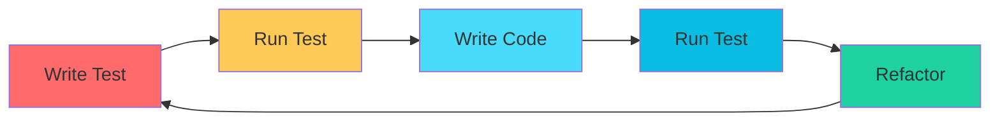

import Tabs from '@theme/Tabs';
import TabItem from '@theme/TabItem';

# 💻 Phase 4: Coding & Implementation

> - The coding phase is where the **actual software development takes place**. Developers translate the design specifications into working code following established standards and best practices.
> - **Transform design specifications into functional software code** that meets all requirements and quality standards.


## Key Roles and Responsibilities

<Tabs>
<TabItem value="senior-dev" label="👨‍💻 Senior Developer" default>

### Senior Developer
- **Primary Role:** Lead development efforts and mentor junior developers
- **Responsibilities:**
  - Implement complex modules and core functionality
  - Code review and quality assurance
  - Technical decision making
  - Architecture implementation guidance
  - Performance optimization

</TabItem>
<TabItem value="junior-dev" label="👩‍💻 Junior Developer">

### Junior Developer
- **Role:** Implement assigned modules under supervision
- **Responsibilities:**
  - Code implementation based on specifications
  - Unit testing development
  - Documentation creation
  - Bug fixing and debugging
  - Learning and skill development

</TabItem>
<TabItem value="fresher" label="🎓 Freshers/Interns">

### Freshers/Interns
- **Role:** Support development with simple tasks
- **Responsibilities:**
  - Basic coding tasks
  - Testing support
  - Documentation assistance
  - Code maintenance
  - Learning and training

</TabItem>
</Tabs>

## Development Process

:::warning Development Workflow
Following a structured development process ensures quality code and timely delivery.
:::

<Tabs>
<TabItem value="task-assignment" label="📋 Task Assignment" default>

### 1. Task Assignment
- **Work Breakdown:** Divide design into manageable coding tasks
- **Priority Setting:** Determine implementation order based on dependencies
- **Resource Allocation:** Assign tasks based on developer skills and experience
- **Timeline Planning:** Set realistic deadlines for each task

</TabItem>
<TabItem value="environment" label="🏗️ Environment Setup">

### 2. Environment Setup
- **Development Environment:** Configure IDEs, tools, and dependencies
- **Version Control:** Set up Git repositories and branching strategies
- **Database Setup:** Create development and testing databases
- **CI/CD Pipeline:** Establish automated build and deployment processes

</TabItem>
<TabItem value="implementation" label="💻 Code Implementation">

### 3. Code Implementation
- **Coding Standards:** Follow established coding conventions and style guides
- **Design Pattern Implementation:** Apply appropriate design patterns
- **Error Handling:** Implement comprehensive error handling mechanisms
- **Logging:** Add appropriate logging for debugging and monitoring

</TabItem>
</Tabs>

## Coding Standards and Best Practices

:::caution Code Quality
Following coding standards ensures maintainable, readable, and scalable code.
:::

<Tabs>
<TabItem value="standards" label="📝 Code Quality" default>

### Code Quality Standards

**Naming Conventions:**
```javascript title="Good vs Bad Examples"
// ✅ Good Examples
const userAccountBalance = 1000;
function calculateTotalPrice(items) { ... }
class PaymentProcessor { ... }

// ❌ Bad Examples
const uab = 1000;
function calc(i) { ... }
class pp { ... }
```

**Code Organization Principles:**
<div style={{display: 'flex', flexDirection: 'column', gap: '0.5rem'}}>

**🧩 Modular Structure:** Organize code into logical modules and components  
**🎯 Single Responsibility:** Each function/class should have one clear purpose  
**🔄 DRY Principle:** Don't Repeat Yourself - avoid code duplication  
**💡 KISS Principle:** Keep It Simple, Stupid - avoid unnecessary complexity

</div>

**Documentation Standards:**
```javascript title="Proper Function Documentation"
/**
 * Calculates the total price including tax and discounts
 * @param {Array} items - Array of items with price and quantity
 * @param {number} taxRate - Tax rate as decimal (e.g., 0.08 for 8%)
 * @param {number} discount - Discount amount
 * @returns {number} Total price after tax and discount
 */
function calculateTotalPrice(items, taxRate, discount) {
    // Implementation here
}
```

</TabItem>
<TabItem value="methodologies" label="🔧 Development Methods">

### Development Methodologies

<details>
<summary>🧪 **Test-Driven Development (TDD)**</summary>

1. **Write Tests First:** Create unit tests before implementation
2. **Implement Code:** Write minimal code to pass tests
3. **Refactor:** Improve code structure while maintaining functionality



</details>

<details>
<summary>🔄 **Continuous Integration**</summary>

- **Automated Builds:** Trigger builds on code commits
- **Automated Testing:** Run test suites automatically
- **Code Quality Checks:** Static analysis and linting
- **Deployment Automation:** Streamlined deployment processes

</details>

</TabItem>
</Tabs>

## Technology Implementation

### 🛠️ Programming Languages & Frameworks
**Selection Criteria:**
- Project requirements and constraints
- Team expertise and experience
- Performance and scalability needs
- Community support and documentation
- Long-term maintainability

**Common Technology Stacks:**
- **Frontend:** React, Angular, Vue.js
- **Backend:** Node.js, Python Django, Java Spring
- **Database:** PostgreSQL, MySQL, MongoDB
- **Cloud:** AWS, Azure, Google Cloud Platform

### 🗄️ Database Implementation
**Key Activities:**
- **Schema Creation:** Implement database tables and relationships
- **Index Optimization:** Create indexes for performance
- **Data Migration:** Transfer existing data if applicable
- **Backup Strategies:** Implement data protection measures

### 🔌 API Development
**Implementation Aspects:**
- **RESTful Services:** Design and implement REST APIs
- **Authentication:** Implement security mechanisms
- **Rate Limiting:** Protect against abuse
- **Documentation:** Create comprehensive API documentation

## Code Review Process

### 🔍 Review Checklist
- **Functionality:** Code meets requirements and specifications
- **Code Quality:** Follows coding standards and best practices
- **Performance:** Efficient algorithms and optimized code
- **Security:** No security vulnerabilities or data exposure
- **Testing:** Adequate test coverage and quality
- **Documentation:** Proper code comments and documentation

### 👥 Review Workflow
1. **Developer Self-Review:** Initial code quality check
2. **Peer Review:** Fellow developer code examination
3. **Senior Review:** Technical lead or architect review
4. **Automated Checks:** Static analysis and automated testing
5. **Approval and Merge:** Final approval and code integration

## Version Control and Collaboration

### 🌿 Git Workflow
**Branching Strategy:**
```
main (production)
├── develop (integration)
│   ├── feature/user-authentication
│   ├── feature/payment-processing
│   └── feature/reporting-module
└── hotfix/critical-bug-fix
```

### 📋 Commit Standards
```bash
# Good commit messages
feat: add user authentication module
fix: resolve payment calculation bug
docs: update API documentation
test: add unit tests for user service

# Bad commit messages
updated code
bug fix
changes
```

## Quality Assurance During Development

### 🧪 Testing Integration
- **Unit Testing:** Test individual functions and methods
- **Integration Testing:** Test module interactions
- **Code Coverage:** Ensure adequate test coverage
- **Performance Testing:** Validate performance requirements

### 🔒 Security Implementation
- **Input Validation:** Sanitize and validate all user inputs
- **Authentication:** Secure user authentication mechanisms
- **Authorization:** Proper access control implementation
- **Data Encryption:** Protect sensitive data

## Common Implementation Challenges

### ⚡ Performance Optimization
**Challenges:**
- Slow database queries
- Memory leaks
- Inefficient algorithms
- Network latency

**Solutions:**
- Query optimization and indexing
- Memory profiling and optimization
- Algorithm analysis and improvement
- Caching strategies

### 🔗 Integration Issues
**Challenges:**
- Third-party API limitations
- Data format mismatches
- Version compatibility
- Network connectivity

**Solutions:**
- Error handling and retry mechanisms
- Data transformation layers
- Version management strategies
- Fallback mechanisms

### 🐛 Debugging and Troubleshooting
**Best Practices:**
- Systematic debugging approach
- Comprehensive logging
- Error tracking tools
- Testing environment replication

## 📋 Deliverables To Next Phase

:::tip Next Phase: Testing Phase
The coding phase provides working software that needs comprehensive testing before deployment.
:::

**Key Deliverables:**

<div style={{display: 'grid', gridTemplateColumns: 'repeat(auto-fit, minmax(300px, 1fr))', gap: '1rem', margin: '1rem 0'}}>

<div style={{padding: '1rem', border: '1px solid var(--ifm-color-emphasis-200)', borderRadius: '8px'}}>
<h4>📦 Source Code</h4>
- Complete, well-documented codebase
- Version-controlled source files
- Code following established standards
- Peer-reviewed and approved code
</div>

<div style={{padding: '1rem', border: '1px solid var(--ifm-color-emphasis-200)', borderRadius: '8px'}}>
<h4>🔧 Build Scripts & Configuration</h4>
- Automated build and deployment scripts
- Environment configuration files
- CI/CD pipeline configurations
- Dependency management files
</div>

<div style={{padding: '1rem', border: '1px solid var(--ifm-color-emphasis-200)', borderRadius: '8px'}}>
<h4>🗄️ Database Scripts</h4>
- Schema creation scripts
- Data migration scripts
- Seed data for testing
- Database optimization scripts
</div>

<div style={{padding: '1rem', border: '1px solid var(--ifm-color-emphasis-200)', borderRadius: '8px'}}>
<h4>📚 Technical Documentation</h4>
- API documentation
- Code documentation and comments
- Implementation decisions log
- Deployment and configuration guides
</div>

<div style={{padding: '1rem', border: '1px solid var(--ifm-color-emphasis-200)', borderRadius: '8px'}}>
<h4>🧪 Unit Tests</h4>
- Comprehensive unit test suite
- Test coverage reports
- Integration test frameworks
- Testing documentation
</div>

<div style={{padding: '1rem', border: '1px solid var(--ifm-color-emphasis-200)', borderRadius: '8px'}}>
<h4>🚀 Executable Application</h4>
- Working software build
- Installation packages
- Runtime dependencies
- Configuration templates
</div>

</div>

---

<div style={{textAlign: 'center', margin: '2rem 0', padding: '1rem', backgroundColor: 'var(--ifm-color-emphasis-100)', borderRadius: '8px'}}>
<h4>🎯 Key Takeaway</h4>
<p><strong>Quality code is the foundation of reliable software.</strong> Following best practices during implementation saves time in testing and maintenance phases.</p>
</div>
