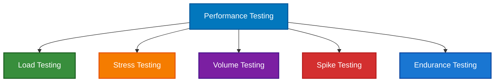
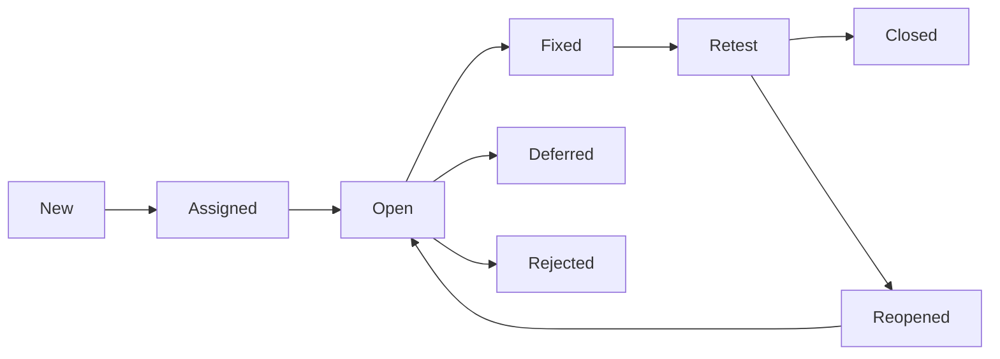

import Tabs from '@theme/Tabs';
import TabItem from '@theme/TabItem';

# 🧪 Phase 5: Testing

:::info
The testing phase ensures that the developed software **meets all requirements and functions correctly**. It involves systematic validation of the software through various testing methodologies and techniques.
:::

## Process Overview

:::tip Objective
**Validate the software against requirements** using comprehensive test cases and identify defects before deployment.
:::

## Key Roles and Responsibilities

<Tabs>
<TabItem value="senior-tester" label="🧪 Senior Tester" default>

### Senior Tester
- **Primary Role:** Lead testing efforts and strategy
- **Responsibilities:**
  - Design test strategies and plans
  - Create complex test scenarios
  - Mentor junior testers
  - Coordinate testing activities
  - Quality assurance oversight

</TabItem>
<TabItem value="junior-tester" label="👩‍🔬 Junior Tester">

### Junior Tester
- **Role:** Execute test cases and report defects
- **Responsibilities:**
  - Execute manual test cases
  - Report and track defects
  - Perform regression testing
  - Create test documentation
  - Support automation efforts

</TabItem>
<TabItem value="testing-fresher" label="🎓 Testing Freshers">

### Testing Freshers
- **Role:** Support testing activities under supervision
- **Responsibilities:**
  - Execute basic test cases
  - Data preparation for testing
  - Defect verification
  - Learning testing methodologies
  - Documentation assistance

</TabItem>
</Tabs>

## Why Separate Testing Team?

### ❓ Why not let developers test their own code?

:::warning Understanding the Need
A dedicated testing team brings objectivity and specialized skills that developers alone cannot provide.
:::

**Reasons for dedicated testing team:**

<div style={{display: 'grid', gridTemplateColumns: 'repeat(auto-fit, minmax(250px, 1fr))', gap: '1rem', margin: '1rem 0'}}>

<div style={{padding: '1rem', border: '1px solid var(--ifm-color-emphasis-200)', borderRadius: '8px'}}>
<h4>🎯 Objectivity Issues</h4>
- Developers may be overconfident about their code
- Emotional attachment to their implementation  
- Bias toward positive scenarios
</div>

<div style={{padding: '1rem', border: '1px solid var(--ifm-color-emphasis-200)', borderRadius: '8px'}}>
<h4>🎪 Skill Specialization</h4>
- Testers focus on breaking the system
- Developers focus on building the system
- Different mindset and approach needed
</div>

<div style={{padding: '1rem', border: '1px solid var(--ifm-color-emphasis-200)', borderRadius: '8px'}}>
<h4>⚡ Quality Concerns</h4>
- Developers may miss negative scenarios
- Tendency to hide or overlook defects
- Time pressure may compromise testing quality
</div>

<div style={{padding: '1rem', border: '1px solid var(--ifm-color-emphasis-200)', borderRadius: '8px'}}>
<h4>🚀 Efficiency</h4>
- Parallel development and testing activities
- Specialized testing tools and techniques
- Dedicated focus on quality assurance
</div>

</div>

## Types of Testing

<Tabs>
<TabItem value="functional" label="📋 Functional Testing" default>

### Functional Testing

:::success Purpose
**Verify that the software functions according to specified requirements**
:::

<details>
<summary>🔲 **Black Box Testing**</summary>

- **Definition:** Testing without knowledge of internal code structure
- **Focus:** Input-output behavior validation
- **Techniques:**
  - Equivalence partitioning
  - Boundary value analysis
  - Decision table testing
  - State transition testing

</details>

<details>
<summary>🧪 **Unit Testing**</summary>

- **Scope:** Individual functions and methods
- **Responsibility:** Usually done by developers
- **Tools:** JUnit, pytest, Jest, Mocha
- **Coverage:** Code coverage analysis

</details>

<details>
<summary>🔗 **Integration Testing**</summary>

**Types:**
- **Big Bang:** All modules integrated simultaneously
- **Incremental:** Modules integrated one by one
  - Top-down approach
  - Bottom-up approach
  - Sandwich/Hybrid approach

</details>

<details>
<summary>🖥️ **System Testing**</summary>

- **Scope:** Complete integrated system
- **Environment:** Production-like test environment
- **Focus:** End-to-end functionality validation

</details>

<details>
<summary>✅ **Acceptance Testing**</summary>

- **User Acceptance Testing (UAT):** End users validate the system
- **Business Acceptance Testing (BAT):** Business stakeholders validation
- **Alpha Testing:** Internal testing by organization
- **Beta Testing:** Limited external user testing

</details>

</TabItem>
<TabItem value="non-functional" label="🔧 Non-Functional Testing">

### Non-Functional Testing

:::success Purpose
**Validate quality attributes like performance, security, and usability**
:::

<details>
<summary>⚡ **Performance Testing**</summary>

- **Load Testing:** Normal expected load
- **Stress Testing:** Beyond normal capacity
- **Volume Testing:** Large amounts of data
- **Spike Testing:** Sudden load increases
- **Endurance Testing:** Extended periods



</details>

<details>
<summary>🔒 **Security Testing**</summary>

- **Authentication Testing:** User verification mechanisms
- **Authorization Testing:** Access control validation
- **Data Protection:** Encryption and data security
- **SQL Injection:** Database security testing
- **Cross-Site Scripting (XSS):** Web application security

</details>

<details>
<summary>👥 **Usability Testing**</summary>

- **User Interface Testing:** UI element validation
- **User Experience Testing:** User workflow validation
- **Accessibility Testing:** Compliance with accessibility standards
- **Cross-Browser Testing:** Multiple browser compatibility

</details>

<details>
<summary>🔧 **Compatibility Testing**</summary>

- **Browser Compatibility:** Different web browsers
- **Operating System:** Multiple OS platforms
- **Device Testing:** Various devices and screen sizes
- **Version Testing:** Different software versions

</details>

</TabItem>
</Tabs>

## Testing Process

### 1. 📋 Test Planning
**Activities:**
- Test strategy definition
- Test scope and objectives
- Resource allocation
- Timeline planning
- Risk assessment

**Deliverables:**
- Test plan document
- Test strategy document
- Resource allocation plan

### 2. 🎯 Test Design
**Activities:**
- Test case creation
- Test data preparation
- Test environment setup
- Test scenario design

**Deliverables:**
- Test cases and test scripts
- Test data sets
- Environment requirements

### 3. ⚡ Test Execution
**Activities:**
- Manual test execution
- Automated test execution
- Defect reporting
- Test result documentation

**Deliverables:**
- Test execution reports
- Defect reports
- Test logs

### 4. 📊 Test Closure
**Activities:**
- Test summary reporting
- Lessons learned documentation
- Test artifact archival
- Quality metrics analysis

**Deliverables:**
- Test summary report
- Quality metrics
- Recommendations

## Test Case Design

### 📝 Test Case Structure
```
Test Case ID: TC_LOGIN_001
Test Case Title: Valid User Login
Test Objective: Verify successful login with valid credentials
Preconditions: User account exists in system
Test Steps:
1. Navigate to login page
2. Enter valid username
3. Enter valid password
4. Click login button
Expected Result: User successfully logged in and redirected to dashboard
Test Data: username: "testuser", password: "password123"
Priority: High
Test Type: Functional
```

### 🎯 Test Case Categories

#### **Positive Test Cases**
- Valid inputs and expected behavior
- Happy path scenarios
- Normal use cases

#### **Negative Test Cases**
- Invalid inputs and error handling
- Boundary condition testing
- Edge case scenarios

#### **Edge Cases**
- Minimum and maximum values
- Empty inputs
- Special characters
- Large data sets

## Defect Management

### 🐛 Defect Life Cycle


### 📊 Defect Classification

#### **By Severity**
- **Critical:** System crashes, data loss
- **High:** Major functionality not working
- **Medium:** Minor functionality issues
- **Low:** Cosmetic issues, typos

#### **By Priority**
- **P1:** Fix immediately
- **P2:** Fix in current release
- **P3:** Fix in next release
- **P4:** Fix when time permits

### 📋 Defect Report Structure
```
Defect ID: DEF_001
Summary: Login fails with valid credentials
Description: Detailed description of the issue
Steps to Reproduce:
1. Navigate to login page
2. Enter valid username and password
3. Click login button
Expected Result: Successful login
Actual Result: Error message displayed
Environment: Chrome 91.0, Windows 10
Severity: High
Priority: P1
Status: New
Assigned To: Development Team
```

## Testing Tools and Technologies

### 🛠️ Automation Tools
- **Selenium:** Web application automation
- **Cypress:** Modern web testing framework
- **Postman:** API testing
- **JMeter:** Performance testing
- **Appium:** Mobile application testing

### 📊 Test Management Tools
- **Jira:** Issue and test management
- **TestRail:** Test case management
- **Zephyr:** Test management for Jira
- **qTest:** Comprehensive test management

### 🔍 Static Analysis Tools
- **SonarQube:** Code quality analysis
- **ESLint:** JavaScript static analysis
- **PMD:** Java static analysis
- **Checkstyle:** Code style checking

## 📋 Deliverables To Next Phase

:::tip Next Phase: Installation & Implementation Phase
The testing phase provides validated software ready for deployment to production environment.
:::

**Key Deliverables:**

<div style={{display: 'grid', gridTemplateColumns: 'repeat(auto-fit, minmax(300px, 1fr))', gap: '1rem', margin: '1rem 0'}}>

<div style={{padding: '1rem', border: '1px solid var(--ifm-color-emphasis-200)', borderRadius: '8px'}}>
<h4>🧪 Test Documentation</h4>
- Comprehensive test plan and strategy
- Complete test case repository
- Test execution reports
- Test coverage analysis
</div>

<div style={{padding: '1rem', border: '1px solid var(--ifm-color-emphasis-200)', borderRadius: '8px'}}>
<h4>🐛 Defect Reports</h4>
- Detailed defect logs and reports
- Defect metrics and analysis
- Resolution status tracking
- Quality metrics dashboard
</div>

<div style={{padding: '1rem', border: '1px solid var(--ifm-color-emphasis-200)', borderRadius: '8px'}}>
<h4>✅ Quality Assurance Certificate</h4>
- QA sign-off and approval
- Testing completion certificate
- Quality compliance report
- Acceptance criteria validation
</div>

<div style={{padding: '1rem', border: '1px solid var(--ifm-color-emphasis-200)', borderRadius: '8px'}}>
<h4>🚀 Validated Software Build</h4>
- Thoroughly tested application
- Performance validated software
- Security tested system
- User acceptance approved product
</div>

<div style={{padding: '1rem', border: '1px solid var(--ifm-color-emphasis-200)', borderRadius: '8px'}}>
<h4>📊 Test Metrics & Reports</h4>
- Test execution metrics
- Code coverage reports
- Performance test results
- Security audit reports
</div>

<div style={{padding: '1rem', border: '1px solid var(--ifm-color-emphasis-200)', borderRadius: '8px'}}>
<h4>🔧 Test Environment Documentation</h4>
- Test environment specifications
- Data setup procedures
- Configuration documentation
- Deployment procedures for production
</div>

</div>

---

<div style={{textAlign: 'center', margin: '2rem 0', padding: '1rem', backgroundColor: 'var(--ifm-color-emphasis-100)', borderRadius: '8px'}}>
<h4>🎯 Key Takeaway</h4>
<p><strong>Thorough testing prevents production issues and ensures user satisfaction.</strong> Quality software testing is an investment in reliability and user trust.</p>
</div>
- **PMD:** Java code analysis
- **Checkstyle:** Coding standard verification

## Quality Metrics

### 📈 Test Coverage Metrics
- **Requirement Coverage:** % of requirements tested
- **Code Coverage:** % of code executed by tests
- **Test Case Coverage:** % of test cases executed
- **Defect Detection Rate:** Defects found vs. total defects

### 🎯 Quality Metrics
- **Defect Density:** Defects per unit of code
- **Defect Removal Efficiency:** Defects found in testing vs. production
- **Test Execution Rate:** Test cases executed per day
- **Pass/Fail Rate:** Percentage of test cases passing

## Best Practices

### ✅ Testing Best Practices
- **Early Testing:** Start testing activities early in SDLC
- **Risk-Based Testing:** Focus on high-risk areas
- **Exploratory Testing:** Combine with scripted testing
- **Continuous Testing:** Integrate testing in CI/CD pipeline
- **Test Data Management:** Maintain quality test data

### 🔄 Continuous Improvement
- **Retrospectives:** Regular team retrospectives
- **Process Optimization:** Continuous process improvement
- **Tool Evaluation:** Regular tool assessment
- **Skill Development:** Ongoing training and learning

## Common Testing Challenges

### ⏰ Time Constraints
- **Challenge:** Limited testing time
- **Solution:** Risk-based testing, automation, parallel testing

### 🛠️ Environment Issues
- **Challenge:** Unstable test environments
- **Solution:** Environment monitoring, backup environments

### 📊 Test Data Management
- **Challenge:** Maintaining quality test data
- **Solution:** Data generation tools, data refresh strategies

### 🔄 Changing Requirements
- **Challenge:** Frequent requirement changes
- **Solution:** Flexible test design, automation, communication

## Deliverables

### 📋 Testing Artifacts
- **Test Plan and Strategy**
- **Test Cases and Scripts**
- **Test Execution Reports**
- **Defect Reports**
- **Test Summary Report**
- **Quality Metrics Dashboard**

## Success Metrics

- **Quality:** Low defect escape rate to production
- **Coverage:** Comprehensive test coverage achieved
- **Efficiency:** Optimal resource utilization
- **Timeline:** Testing completed within schedule
- **Customer Satisfaction:** User acceptance achieved
