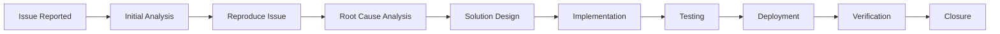

# 🔧 Phase 7: Maintenance & Support

The maintenance phase ensures the continued operation and improvement of the software after deployment. This phase typically lasts 6-9 months or longer, depending on the contract terms.

## Process Overview

**Objective:** Provide ongoing support, fix defects found by customers, implement minor enhancements, and ensure optimal system performance in the production environment.

## Key Characteristics

### 🆓 Free Support Period
- **Duration:** Typically 6-9 months after go-live
- **Coverage:** Defects found by customers are fixed free of charge
- **Scope:** Bug fixes, performance issues, and system optimization
- **Exclusions:** New feature requests and scope changes

### 👥 Team Structure
**Smaller, Specialized Team:**
- **Developers:** For bug fixes and minor enhancements
- **Testers:** For validation and regression testing
- **Support Engineers:** For customer issue resolution
- **Technical Lead:** For coordination and escalation

## Types of Maintenance

### 1. 🛠️ Corrective Maintenance
**Purpose:** Fix defects and bugs discovered in production

**Activities:**
- **Bug Reproduction:** Replicate issues in test environment
- **Root Cause Analysis:** Identify underlying causes
- **Fix Development:** Implement solutions
- **Testing:** Validate fixes don't introduce new issues
- **Deployment:** Release fixes to production

**Example Scenarios:**
- Application crashes under specific conditions
- Incorrect calculations in business logic
- Data corruption or loss issues
- Security vulnerabilities discovered
- Performance degradation problems

### 2. 🔄 Adaptive Maintenance
**Purpose:** Modify software to work in new or changed environments

**Activities:**
- **Environment Updates:** Adapt to new operating systems
- **Technology Upgrades:** Update to newer framework versions
- **Integration Changes:** Modify external system integrations
- **Compliance Updates:** Meet new regulatory requirements
- **Platform Migration:** Move to new hardware or cloud platforms

**Example Scenarios:**
- Operating system security updates
- Database version upgrades
- Third-party API changes
- New browser compatibility requirements
- Cloud platform migrations

### 3. ⚡ Perfective Maintenance
**Purpose:** Improve performance, maintainability, or user experience

**Activities:**
- **Performance Optimization:** Improve system speed and efficiency
- **Code Refactoring:** Improve code quality and maintainability
- **User Interface Improvements:** Enhance user experience
- **Documentation Updates:** Keep documentation current
- **Process Optimization:** Improve operational procedures

**Example Scenarios:**
- Database query optimization
- User interface responsiveness improvements
- Code cleanup and documentation
- Workflow streamlining
- System monitoring enhancements

### 4. 🛡️ Preventive Maintenance
**Purpose:** Prevent future problems and improve system reliability

**Activities:**
- **Code Reviews:** Regular code quality assessments
- **Security Audits:** Proactive security assessments
- **Performance Monitoring:** Continuous system monitoring
- **Capacity Planning:** Plan for future growth
- **Risk Mitigation:** Address potential future issues

**Example Scenarios:**
- Regular security patches
- Database maintenance and optimization
- Log file cleanup and archival
- Backup system testing
- Disaster recovery planning

## Maintenance Process

### 1. 📞 Issue Identification
**Sources of Issues:**
- **Customer Reports:** Issues reported by end users
- **System Monitoring:** Automated alerts and monitoring
- **Proactive Monitoring:** Regular system health checks
- **Audit Findings:** Security or compliance audits
- **Performance Analysis:** Regular performance reviews

### 2. 🎯 Issue Classification
**Priority Classification:**
```
Critical (P1): System down, data loss, security breach
High (P2): Major functionality not working
Medium (P3): Minor functionality issues
Low (P4): Cosmetic issues, enhancements
```

**Impact Assessment:**
- **Business Impact:** Effect on business operations
- **User Impact:** Number of users affected
- **Technical Impact:** System stability and performance
- **Financial Impact:** Cost implications

### 3. 🔍 Issue Resolution
**Resolution Workflow:**


### 4. ✅ Validation and Closure
**Validation Steps:**
- **Fix Verification:** Confirm issue is resolved
- **Regression Testing:** Ensure no new issues introduced
- **Customer Acceptance:** Customer confirms resolution
- **Documentation:** Update knowledge base
- **Closure:** Close issue with root cause and solution

## Support Services

### 📞 Help Desk Support
**Service Levels:**
- **L1 Support:** Basic issue triage and resolution
  - User account issues
  - Basic troubleshooting
  - Documentation and guidance
  - Issue escalation

- **L2 Support:** Technical issue resolution
  - Application configuration issues
  - Data problems
  - Performance issues
  - Complex troubleshooting

- **L3 Support:** Advanced technical support
  - Code-level issues
  - Architecture problems
  - Complex integrations
  - System modifications

### 🕐 Service Level Agreements (SLA)
**Response Time SLAs:**
```
Critical Issues: 2 hours
High Priority: 8 hours
Medium Priority: 24 hours
Low Priority: 72 hours
```

**Resolution Time SLAs:**
```
Critical Issues: 8 hours
High Priority: 24 hours
Medium Priority: 5 business days
Low Priority: 10 business days
```

### 📊 Monitoring and Reporting
**Monitoring Activities:**
- **System Health:** Real-time system monitoring
- **Performance Metrics:** Response time and throughput
- **Error Tracking:** Application errors and exceptions
- **Usage Analytics:** User activity and feature usage
- **Security Monitoring:** Security events and threats

**Reporting:**
- **Monthly Status Reports:** System health and issue summary
- **Performance Reports:** System performance trends
- **Incident Reports:** Detailed analysis of major incidents
- **Trending Analysis:** Issue patterns and recommendations

## Knowledge Management

### 📚 Knowledge Base
**Components:**
- **Issue Database:** Historical issues and resolutions
- **Solution Library:** Reusable solutions and workarounds
- **Best Practices:** Operational best practices
- **Troubleshooting Guides:** Step-by-step problem resolution
- **FAQs:** Frequently asked questions and answers

### 📖 Documentation Maintenance
**Documentation Types:**
- **User Documentation:** Keep user manuals updated
- **Technical Documentation:** System architecture and configuration
- **Operational Procedures:** Day-to-day operational tasks
- **Emergency Procedures:** Incident response and recovery
- **Training Materials:** Updated training content

## Continuous Improvement

### 📈 Performance Optimization
**Optimization Areas:**
- **Application Performance:** Code and query optimization
- **Infrastructure Performance:** Hardware and network optimization
- **User Experience:** Interface and workflow improvements
- **Process Efficiency:** Operational process improvements

### 🔄 Process Improvement
**Improvement Activities:**
- **Process Analysis:** Regular process effectiveness review
- **Automation:** Automate repetitive tasks
- **Tool Enhancement:** Improve support tools and systems
- **Training:** Ongoing team skill development
- **Customer Feedback:** Incorporate user suggestions

### 📊 Metrics and KPIs
**Support Metrics:**
- **Resolution Time:** Average time to resolve issues
- **First Call Resolution:** Issues resolved on first contact
- **Customer Satisfaction:** User satisfaction scores
- **System Availability:** Uptime and availability metrics
- **Issue Volume:** Number and types of issues reported

## Transition Planning

### 🔄 End of Maintenance Period
**Transition Options:**
- **Extended Support Contract:** Continue paid support
- **Knowledge Transfer:** Transfer to customer IT team
- **Vendor Change:** Transition to new support vendor
- **System Replacement:** Migrate to new system

### 📋 Handover Process
**Handover Activities:**
- **Knowledge Transfer:** Complete system knowledge transfer
- **Documentation Handover:** All documentation and procedures
- **Tool Access:** Transfer access to support tools
- **Team Training:** Train customer support team
- **Gradual Transition:** Phased reduction of support

## Cost Management

### 💰 Maintenance Costs
**Cost Components:**
- **Personnel Costs:** Support team salaries and benefits
- **Infrastructure Costs:** Hosting and infrastructure expenses
- **Tool Costs:** Support and monitoring tool licenses
- **Training Costs:** Ongoing team training and certification
- **Overhead Costs:** Administrative and management overhead

### 📊 Cost Optimization
**Optimization Strategies:**
- **Automation:** Reduce manual effort through automation
- **Preventive Maintenance:** Reduce reactive support costs
- **Knowledge Sharing:** Improve team efficiency
- **Tool Optimization:** Use cost-effective tools and platforms
- **Resource Planning:** Optimize team size and skills

## Common Maintenance Challenges

### ⚡ Technical Challenges
**Legacy System Issues:**
- Outdated technology stacks
- Compatibility problems
- Performance degradation
- Security vulnerabilities

**Integration Challenges:**
- Third-party system changes
- API deprecations
- Data format changes
- Communication failures

### 👥 Organizational Challenges
**Resource Constraints:**
- Limited budget for maintenance
- Skill gaps in support team
- Competing priorities
- Staff turnover

**Communication Issues:**
- Poor customer communication
- Unclear requirements
- Expectation misalignment
- Documentation gaps

## Deliverables

### 📋 Maintenance Deliverables
- **Monthly Status Reports**
- **Issue Resolution Reports**
- **Performance Analysis Reports**
- **System Health Reports**
- **Knowledge Base Updates**
- **Process Improvement Recommendations**

### 📊 Final Maintenance Report
**Report Contents:**
- **Support Summary:** Overall support statistics
- **Issue Analysis:** Types and patterns of issues
- **Performance Trends:** System performance over time
- **Lessons Learned:** Key insights and recommendations
- **Future Recommendations:** Suggestions for ongoing maintenance

## Success Metrics

- **Customer Satisfaction:** High user satisfaction scores
- **System Reliability:** High availability and low downtime
- **Issue Resolution:** Quick and effective issue resolution
- **Knowledge Transfer:** Successful knowledge transfer to customer
- **Cost Effectiveness:** Maintenance within budget constraints
- **Continuous Improvement:** Regular system and process improvements
