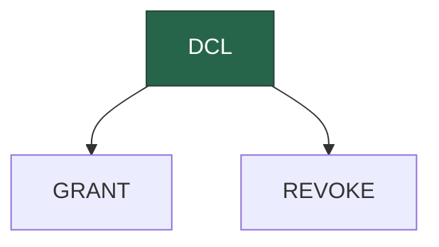

Data Control Language (DCL) commands are used to control access to data within the database.



:::tip INFO

- **GRANT:** Use the `GRANT` statement to grant privileges on database objects to a role.
- **REVOKE:** Use the `REVOKE` statement to revoke previously granted privileges on database objects from a role.
  :::

## GRANT

After creating a role with the LOGIN attribute, the role can log in to the PostgreSQL database server. However, it cannot interact with database objects like tables, views, or functions.

To allow a role to interact with database objects, you need to grant privileges using the GRANT statement.

```sql title="Syntax:"
GRANT privilege_list | ALL
ON table_name
TO role_name;
```

- **privilege_list:** Can be SELECT, INSERT, UPDATE, DELETE, TRUNCATE, etc. Use ALL to grant all privileges on a table.
- **table_name:** The name of the table.
- **role_name:** The name of the role to which you want to grant privileges.

<details>
<summary>PostgreSQL GRANT statement examples</summary>

First, use the `postgres` user to connect to the PostgreSQL server using any client tool of your choice, for example, psql:

```bash
psql -U postgres
```

Second, create a new user role called `joe` that can log in to the PostgreSQL server:

```
create role joe
login
password 'YourPassword';
```

Replace the `YourPassword` with the one you want.

Third, [create a new table](ddl/table#create-table) called `candidates`:

```sql
create table candidates (
    candidate_id int generated always as identity,
    first_name varchar(100) not null,
    last_name varchar(100) not null,
    email varchar(255) not null unique,
    phone varchar(25) not null,
    primary key(candidate_id)
);
```

Fourth, use the role `joe` to log in to the PostgreSQL server in a separate session.

Fifth, attempt to select data from the `candidates` table from the `joe`‘s session:

```sql
SELECT * FROM candidates;
```

PostgreSQL issued an error:

```sql
ERROR:  permission denied for table candidates
```

The output indicates that the role joe does not have the privilege of retrieving data from the `candidates` table.

To grant the `SELECT` privilege on the `candidates` table to the role `joe`, you execute the following `GRANT` statement in the `postgres`‘ session:

```sql
GRANT SELECT
ON candidates
TO joe;
```

Sixth, execute the `SELECT` statement from the `joe`‘s session:

```sql
SELECT * FROM candidates;
```

PostgreSQL returns an empty result set instead of an error.

Seventh, execute the following [`INSERT`](dml/table#insert) statement:

```sql
INSERT INTO candidates(first_name, last_name, email, phone)
VALUES('Joe','Com','[[email protected]](../cdn-cgi/l/email-protection.html)','408-111-2222');
```

PostgreSQL issued the following error because `joe` does not have the `INSERT` privilege on the `candidates` table:

```sql
ERROR:  permission denied for table candidates
```

Eighth, grant `INSERT`, `UPDATE`, and `DELETE` privileges on the `candidates` table to the role `joe`:

```sql
GRANT INSERT, UPDATE, DELETE
ON candidates
TO joe;
```

Ninth, execute the `INSERT` statement again from the `joe`‘s session:

```sql
INSERT INTO candidates(first_name, last_name, email, phone)
VALUES('Joe','Com','[[email protected]](../cdn-cgi/l/email-protection.html)','408-111-2222');
```

Now, `joe` can insert data into the `candidates` table. Additionally, it can update or delete data from the table.

**Let’s take some more examples of using the `GRANT` statement.**

<details>
<summary>Grant all privileges on a table to a role</summary>

The following statement grants all privileges on the `candidates` table to the role `joe`:

```sql
GRANT ALL
ON candidates
TO joe;
```

</details>

<details>
<summary>Grant all privileges on all tables in a schema to a role</summary>

The following statement grants all privileges on all tables in the `public` schema of the `dvdrental` sample database to the role `joe`:

```sql
GRANT ALL
ON ALL TABLES
IN SCHEMA "public"
TO joe;
```

</details>

<details>
<summary>Grant SELECT on all tables</summary>

Sometimes, you want to create a readonly role that can only select data from all tables in a specified schema.

To do that, you can grant the `SELECT` privilege on all tables in the `public` schema like this:

```sql
GRANT SELECT
ON ALL TABLES
IN SCHEMA "public"
TO reader;
```

</details>

</details>

So far, you have learned how to grant privileges on tables. To grant privileges to a role on other database objects, check [the `GRANT` statement syntax](https://www.postgresql.org/docs/current/sql-grant.html).

## REVOKE

The REVOKE statement revokes previously granted privileges on database objects from a role.

```sql title="Syntax:"
REVOKE privilege | ALL
ON TABLE table_name | ALL TABLES IN SCHEMA schema_name
FROM role_name;
In this syntax:
```

First, specify one or more privileges that you want to revoke or use the ALL option to revoke all privileges.
Second, provide the name of the table after the ON keyword or use the ALL TABLES to revoke specified privileges from all tables in a schema.
Third, specify the name of the role from which you want to revoke privileges.

<details>
<summary>PostgreSQL REVOKE statement examples</summary>

<details>
<summary>Step 1\. Create a role and grant privileges</summary>

First, use the `postgres` user to log in to the `dvdrental` [sample database](../postgresql-getting-started/postgresql-sample-database):

```bash
psql -U postgres -d dvdrental
```

Second, [create a new role](postgresql-roles) called `jim` with the `LOGIN` and `PASSWORD` attributes:

```sql
CREATE ROLE jim LOGIN PASSWORD 'YourPassword';
```

Replace the `YourPassword` with the one you want.

Third, grant all privileges to the role `jim` on the `film` table:

```sql
GRANT ALL ON film TO jim;
```

Finally, grant the `SELECT` privilege on the `actor` table to the role `jim`:

```sql
GRANT SELECT ON actor TO jim;
```

</details>

<details>
<summary>Step 2\. Revoke privileges from a role</summary>

To revoke the `SELECT` privilege on the `actor` table from the role `jim`, you use the following statement:

```sql
REVOKE SELECT ON actor FROM jim;
```

To revoke all privileges on the `film` table from the role `jim`, you use `REVOKE` statement with the `ALL` option like this:

```sql
REVOKE ALL ON film FROM jim;
```

</details>

</details>
