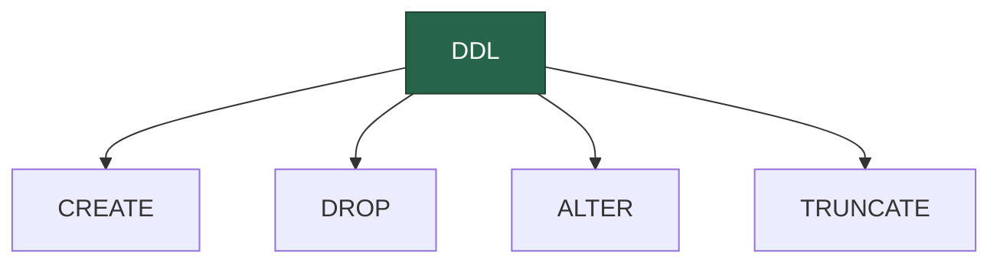

Data Definition Language (DDL) commands are used to define and manage database structures such as tables, indexes, and schemas.

:::tip INFO

- **CREATE:** Creates a new table or database.
- **ALTER:** Modifies an existing database object.
- **DROP:** Deletes an entire table, database, or other objects.
- **TRUNCATE:** Removes all records from a table, deleting the space allocated for the

:::
