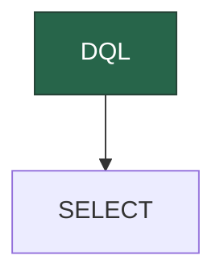

Data Query Language (DQL) commands are used to query the database for information.

```mermaid
flowchart TB
    E["DQL"] --> E1["SELECT"]

    E:::Pine
    classDef Pine stroke-width:1px, stroke-dasharray:none, stroke:#254336, fill:#27654A, color:#FFFFFF
```

:::tip INFO

- **SELECT:** Retrieves data from the database.
  :::
