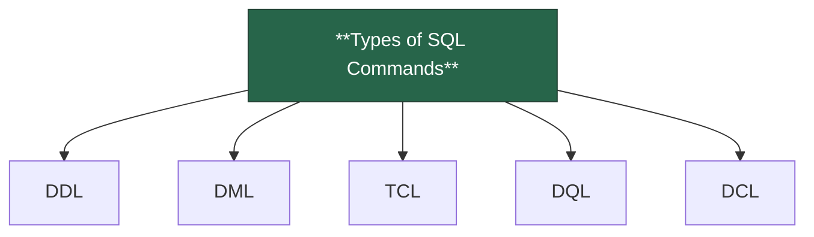
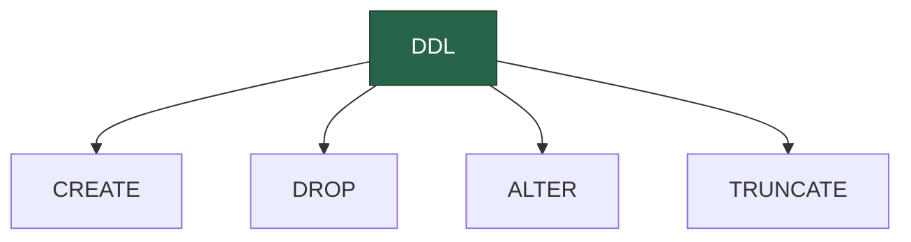
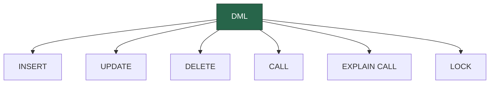
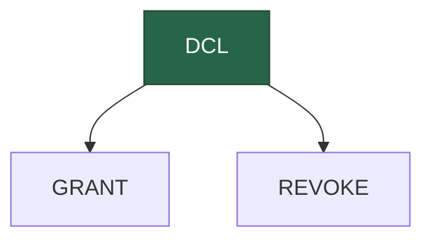
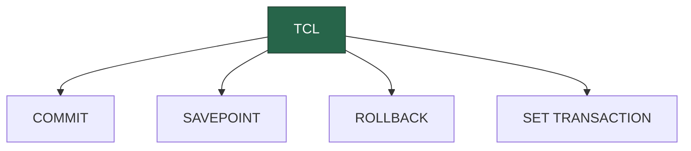
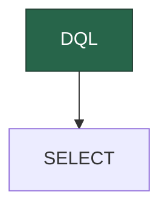

## **What are SQL Commands?**

SQL commands are the fundamental building blocks for interacting with a **DBMS**. They perform various operations such as creating tables, inserting data, querying information, and managing access and security.

SQL commands are categorized into different types, each serving a specific purpose in database management:

## **Types of SQL Commands**

### **DDL (Data Definition Language)**

Data Definition Language (DDL) commands are used to define and manage database structures such as tables, indexes, and schemas.

:::tip INFO

- **CREATE:** Creates a new table or database.
- **ALTER:** Modifies an existing database object.
- **DROP:** Deletes an entire table, database, or other objects.
- **TRUNCATE:** Removes all records from a table, deleting the space allocated for the records.
  :::

### **DML (Data Manipulation Language)**

Data Manipulation Language (DML) commands are used for managing data within schema objects.

:::tip INFO

- **INSERT:** Adds new data to a table.
- **UPDATE:** Modifies existing data within a table.
- **DELETE:** Removes data from a table.
- **CALL:** Executes a stored procedure.
- **EXPLAIN CALL:** Provides information about how a stored procedure is executed.
- **LOCK:** Locks a table or a row for a transaction.
  :::

### **DCL (Data Control Language)**

Data Control Language (DCL) commands are used to control access to data within the database.

:::tip INFO

- **GRANT:** Gives users access privileges to the database.
- **REVOKE:** Removes access privileges given with the GRANT command.
  :::

### **TCL (Transaction Control Language)**

Transaction Control Language (TCL) commands are used to manage transactions in the database.

:::tip INFO

- **COMMIT:** Saves all changes made in the current transaction.
- **ROLLBACK:** Restores the database to the last committed state.
- **SAVEPOINT:** Sets a savepoint within a transaction.
- **SET TRANSACTION:** Places a name on a transaction.
  :::

### **DQL (Data Query Language)**

Data Query Language (DQL) commands are used to query the database for information.

:::tip INFO

- **SELECT:** Retrieves data from the database.
  :::
