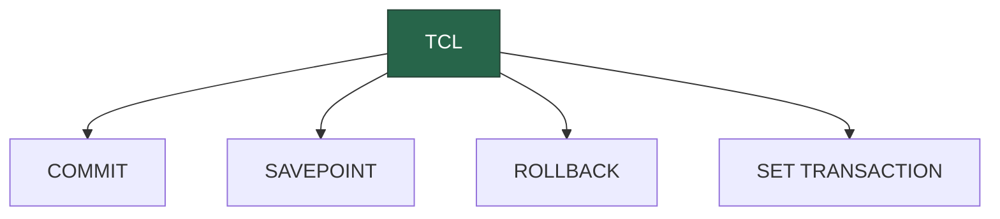

Transaction Control Language (TCL) commands are used to manage transactions in the database.

:::tip INFO

- **COMMIT:** Saves all changes made in the current transaction.
- **ROLLBACK:** Restores the database to the last committed state.
- **SAVEPOINT:** Sets a savepoint within a transaction.
- **SET TRANSACTION:** Places a name on a transaction.
  :::
